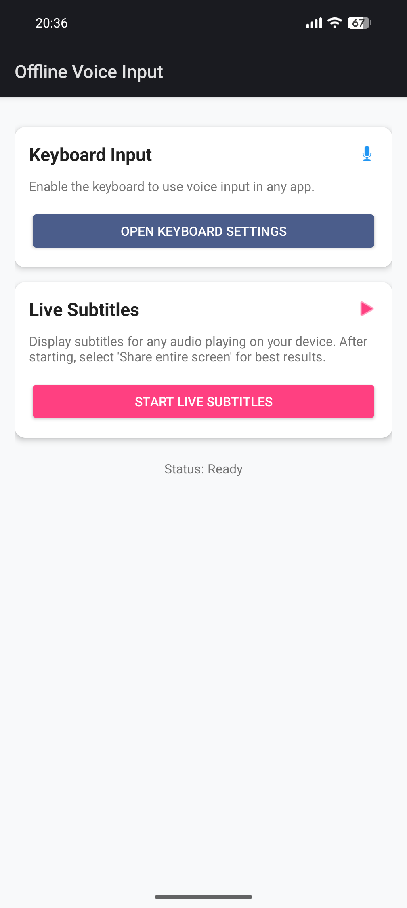
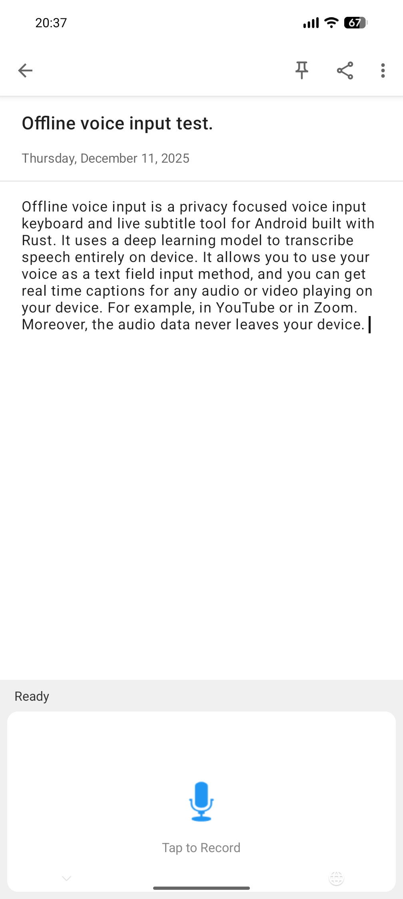

# Offline Voice Input (Android)

[](https://github.com/notune/android_transcribe_app/releases/latest)

An offline, privacy-focused voice input keyboard and live subtitle tool for Android, built with Rust.

## Features

- **Offline Transcription:** Uses deep learning models (Parakeet TDT) to transcribe speech entirely on-device.
- **Voice Input Keyboard** Use your voice as a text field input method.
- **Live Subtitles:** Get real-time captions for any audio or video playing on your device (e.g., YouTube, Podcasts, Zoom).
- **Privacy-First:** No audio data leaves your device.
- **Rust Backend:** Efficient and safe native code using [transcribe-rs](https://github.com/cjpais/transcribe-rs) (included).
- **Native Android UI:** Clean Material Design interface.

## Screenshots
<p float="left">
  
  
   
</p>

## Building Prerequisites (Linux)

To build this app, you need the following system packages:

```bash
sudo pacman -Syu jdk-openjdk rustup unzip zip base-devel cmake
```
*(Adjust for your distribution: e.g., `apt install openjdk-17-jdk build-essential cmake unzip` on Ubuntu)*

Ensure you have the `aarch64-linux-android` target for Rust:
```bash
rustup target add aarch64-linux-android
```

Download and extract the parakeet model
```bash
curl -L https://blob.handy.computer/parakeet-v3-int8.tar.gz | tar -xz -C assets
```

### Android SDK Setup (Manual)

Follow these steps to set up the SDK and NDK:

1.  **Setup Directory:**
    ```bash
    mkdir -p android-sdk/cmdline-tools
    cd android-sdk
    ```

2.  **Download Tools:**
    Download the command-line tools from [Android Developers](https://developer.android.com/studio#command-tools) or use `wget`:
    ```bash
    wget https://dl.google.com/android/repository/commandlinetools-linux-11076708_latest.zip -O cmdline-tools.zip
    unzip -q cmdline-tools.zip
    mkdir -p cmdline-tools/latest
    mv cmdline-tools/bin cmdline-tools/lib cmdline-tools/NOTICE.txt cmdline-tools/source.properties cmdline-tools/latest/
    rm cmdline-tools.zip
    ```

3.  **Install SDK Components:**
    ```bash
    export ANDROID_HOME=$(pwd)
    export PATH=$PATH:$ANDROID_HOME/cmdline-tools/latest/bin
    
    yes | sdkmanager --licenses
    # Install Platform, Build Tools, and Platform Tools
    sdkmanager "platforms;android-35" "build-tools;35.0.0" "platform-tools"
    ```

4.  **Install NDK r28:**
    ```bash
    # Inside android-sdk/ndk/
    mkdir -p ndk
    cd ndk
    wget https://dl.google.com/android/repository/android-ndk-r28-linux.zip
    unzip -q android-ndk-r28-linux.zip
    rm android-ndk-r28-linux.zip
    ```
    *Note: Ensure your `ANDROID_NDK_HOME` environment variable points to this directory (e.g., `.../android-sdk/ndk/android-ndk-r28`).*

## Building

### APK (Debug/Release)
You can build a standalone APK for testing:
```bash
# Ensure ANDROID_HOME and ANDROID_NDK_HOME are set
export ANDROID_HOME=$(pwd)/android-sdk
export ANDROID_NDK_HOME=$ANDROID_HOME/ndk/android-ndk-r28

./build.sh
# Output: android_transcribe_app_release.apk
```

### Release AAB (Google Play Ready)

1.  **Run the AAB Build Script:**
    ```bash
    ./build_aab.sh
    ```
    This will:
    - Build the Rust library in `release` mode.
    - Create a `base` module for the app code.
    - Create a `model_assets` module for the large model files (Install-Time Asset Pack).
    - Generate `android_transcribe_app.aab`.
    - Sign it with a generated `release.keystore`

    **Output:** `android_transcribe_app.aab`

2.  **Testing the AAB on a Device:**
    You cannot install an `.aab` directly. Use `bundletool` (downloaded to `libs/` by the script):

    ```bash
    # 1. Generate APKs from the bundle
    java -jar libs/bundletool.jar build-apks \
        --bundle=android_transcribe_app.aab \
        --output=android_transcribe_app.apks \
        --ks=release.keystore \
        --ks-pass=pass:password \
        --ks-key-alias=release \
        --key-pass=pass:password \
        --overwrite

    # 2. Install to connected device
    # Ensure ADB is in your PATH or provide it via --adb
    java -jar libs/bundletool.jar install-apks \
        --apks=android_transcribe_app.apks \
        --adb=android-sdk/platform-tools/adb
    ```

## Acknowledgments

- **Speech Model:** [Parakeet TDT 0.6b v3](https://huggingface.co/nvidia/parakeet-tdt-0.6b-v3) by NVIDIA.
  - Licensed under [CC-BY 4.0](https://creativecommons.org/licenses/by/4.0/).
  - *Note: This application uses a quantized (int8) version of the original model.*

- **Inference Backend:** [transcribe-rs](https://github.com/cjpais/transcribe-rs) by CJ Pais.

## License of this Project

[MIT](LICENSE)
